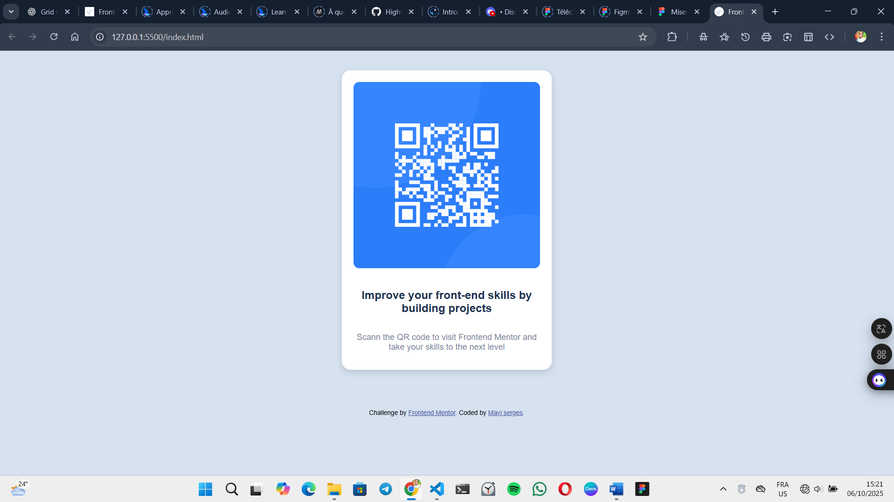

# Frontend Mentor - QR code component solution

This is a solution to the [QR code component challenge on Frontend Mentor](https://www.frontendmentor.io/challenges/qr-code-component-iux_sIO_H). Frontend Mentor challenges help you improve your coding skills by building realistic projects.

## Table of contents

  - [Screenshot](#screenshot)
  - [Links](#links)
- [My process](#my-process)
  - [Built with](#built-with)
  - [What I learned](#what-i-learned)
  - [Continued development](#continued-development)
  - [Useful resources](#useful-resources)
- [Author](#author)
- [Acknowledgments](#acknowledgments)


### Screenshot



Here’s a screenshot of my browser. You can see the result of my work.
I’m not really sure what else to write, so let’s leave it at that.


### Links

- Solution URL: [Add solution URL here](https://your-solution-url.com)
- Live Site URL: [Add live site URL here](https://your-live-site-url.com)

## My process

I was really lost at first and didn’t know where to start. I used Grid for everything related to the body and Flexbox to organize the card itself.

### Built with

- Semantic HTML5 markup
- CSS custom properties
- Flexbox
- CSS Grid
- Mobile-first workflow


### What I learned

```css
.attribution a {
  color: hsl(228, 45%, 44%);
}
```

use hsl(h:'hue', s:'saturation', l:'lightness') for color.

If you want more help with writing markdown, we'd recommend checking out [The Markdown Guide](https://www.markdownguide.org/) to learn more.


### Continued development

I’m not used to concepts like Grid and Flexbox, so this was a great opportunity to strengthen my understanding of them. I also learned more about organizing my HTML code — especially with tags, classes, and so on. I discovered new CSS properties and got a better grasp of how everything fits together. So I’m really happy about it.


### Useful resources

J'ai juste utlise VS code 

## Author

<!-- - Website - [Add your name here](https://www.your-site.com) -->
- Frontend Mentor - [@Hightechvisual](https://www.frontendmentor.io/profile/Hightechvisual)
- Twitter - [@mayiwilliam](https://x.com/mayiwilliam?t=Gg_xHm-Ms27YJzwSY646Pg&s=09)


## Acknowledgments

The project was inspired by Frontend Mentor. It’s a site I just discovered. I recently finished learning HTML and CSS, so I needed to strengthen my skills. Thanks to Frontend Mentor and its many ready-made project ideas, I just have to start coding, and that’s it. I have a base visual to follow and can build from there. Thank you so much — this platform is going to help me a lot.
